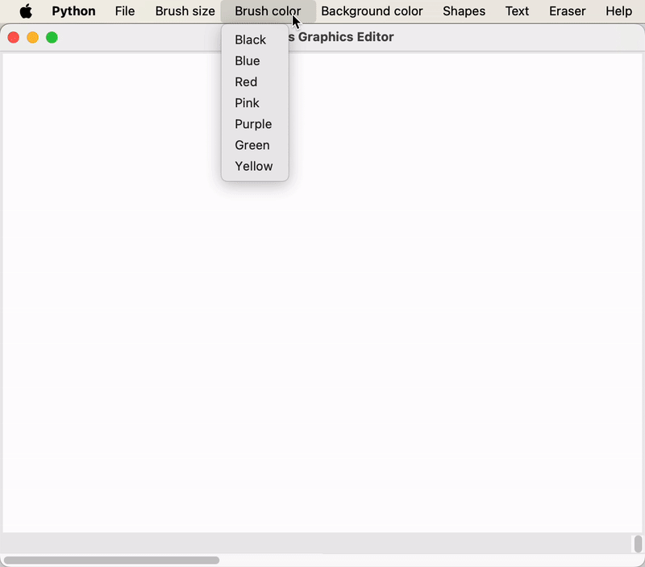

<h1 align="center">Graphics Editor</h1>
 

 
 
     
   

<h2>Project description</h2>
Graphics Editor is a simple and intuitive drawing application, similar to Paint, built using Python's Tkinter library. This tool allows users to draw, edit, and save their creations with various brushes, colors, shapes, and text.

<h2>Features</h2>
<ul>
  <li><b>Drawing:</b> Use different brush sizes and colors to draw freehand on the canvas.</li>
  <li><b>Shapes:</b> Add rectangles, circles, triangles, lines, and arcs with customizable colors.</li>
  <li><b>Text:</b> Add text with customizable fonts and colors.</li>
  <li><b>Eraser:</b> Erase parts of the drawing with different eraser sizes.</li>
  <li><b>Background:</b> Change the canvas background color.</li>
  <li><b>Save:</b> Save your drawing as an image file.</li>
  <li><b>Open:</b> Open and edit existing image files.</li>
  <li><b>Fullscreen:</b> Toggle fullscreen mode for an immersive drawing experience.</li>
  <li><b>Clear:</b> Clear the entire canvas.</li>
  <li><b>Help:</b> Access help and information about the application.</li>
</ul>
 
<h2>Technologies Used</h2>

 Tkinter
 Pillow

<h2>Getting Started</h2>
To get a local copy up and running, follow these simple steps.

<h3>Prerequisites</h3>
Before you begin, ensure you have python and pip installed.

<h3>Installation</h3>
<h5>Clone the repository:</h5>
https://github.com/Yuliia-Kruta/graphic-editor.git

<h5>Navigate to the project directory:</h5>
cd graphic-editor

<h5>Install the dependencies:</h5>
pip install pillow

<h5>Run the application:</h5>
python main.py

<h2>How to Use</h2>
- Use the menu options to select brush sizes, colors, shapes, and other functionalities. 
- Draw on the canvas using the left mouse button. 
- Add shapes and text using the right mouse button. 
- Save your drawing by pressing the S key or using the "Save" option in the "File" menu. 
- Exit the fullscreen mode by pressing the Escape key. 

<h2>License</h2>
Distributed under the MIT License. See LICENSE for more information.
